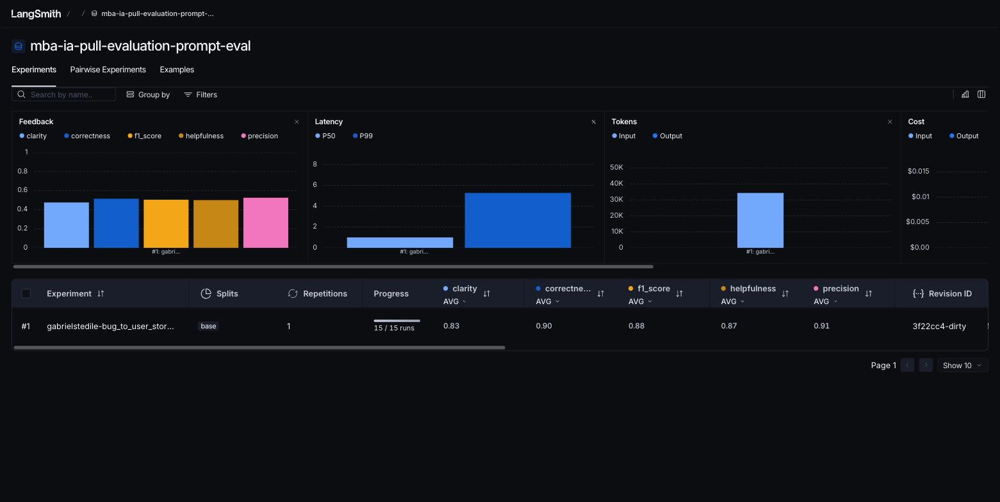
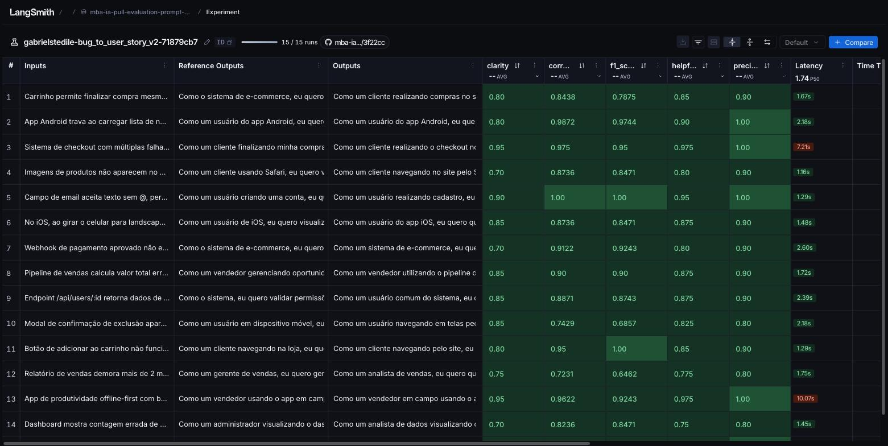
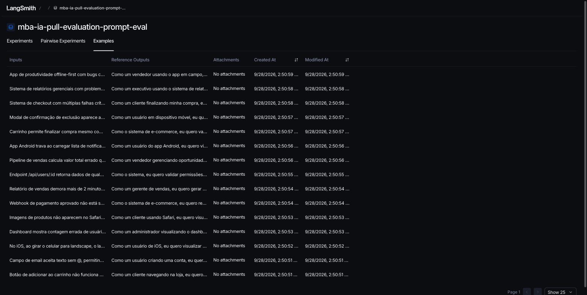
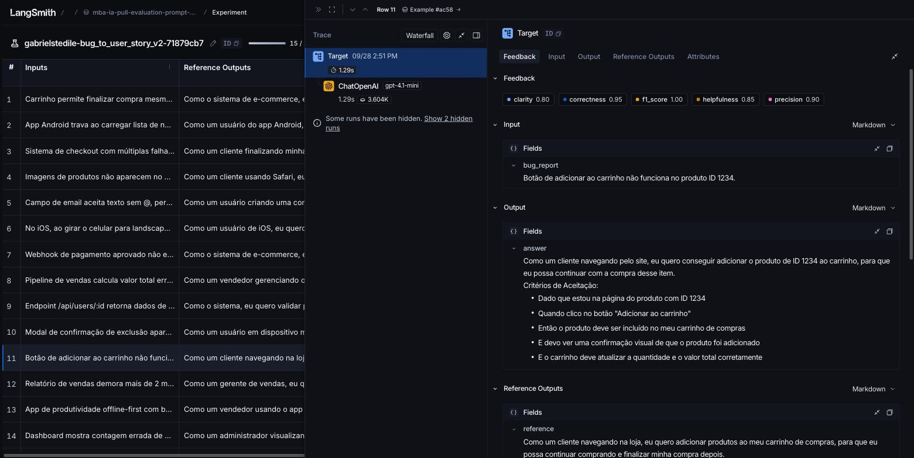
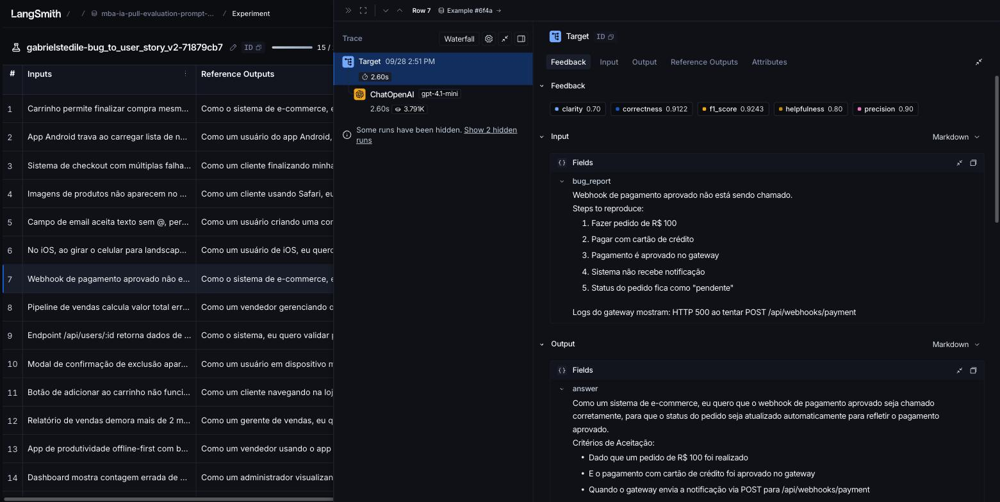
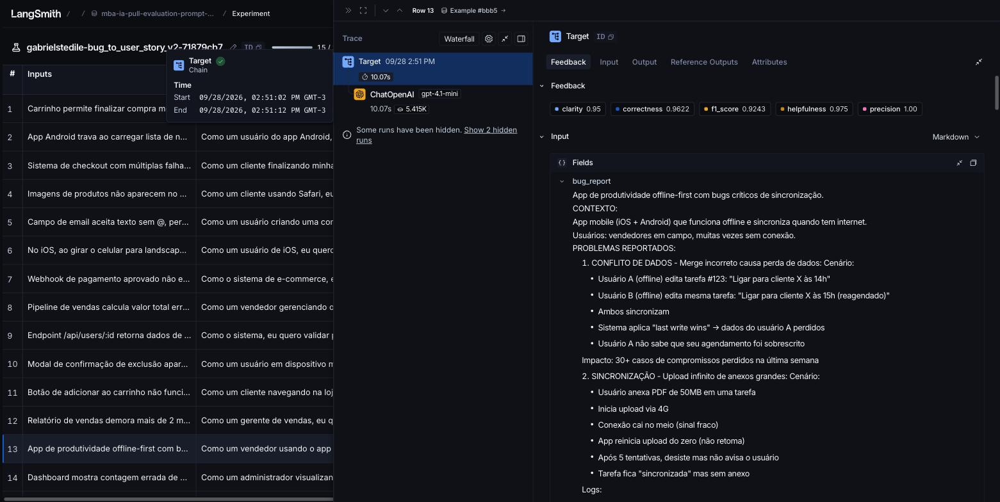
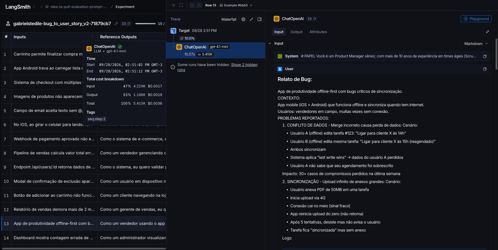
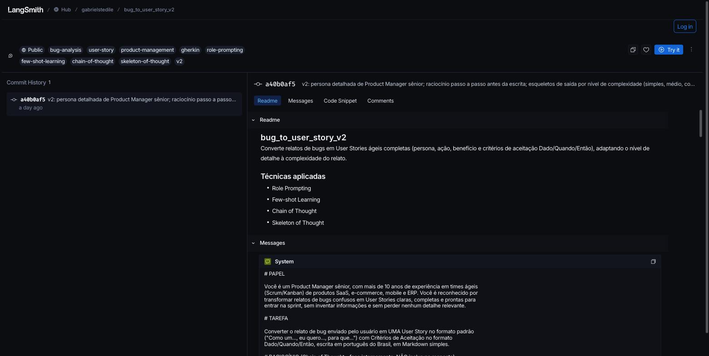

# Desafio MBA Engenharia de Software com IA - Full Cycle

## Pull, Otimização e Avaliação de Prompts com LangChain e LangSmith

Software capaz de fazer **pull** de um prompt de baixa qualidade do LangSmith Prompt Hub, **refatorá-lo** com técnicas avançadas de Prompt Engineering, fazer **push** da versão otimizada de volta ao Hub e **avaliá-la** com 5 métricas customizadas (Helpfulness, Correctness, F1-Score, Clarity e Precision), atingindo **>= 0.8 em todas**.

Tarefa do prompt: converter relatos de bugs em User Stories ágeis.

## Sumário

- [Estrutura do projeto](#estrutura-do-projeto)
- [Técnicas Aplicadas (Fase 2)](#técnicas-aplicadas-fase-2)
- [Processo de otimização (iterações)](#processo-de-otimização-iterações)
- [Resultados Finais](#resultados-finais)
- [Como Executar](#como-executar)
- [Testes de validação](#testes-de-validação)

## Estrutura do projeto

```
mba-ia-pull-evaluation-prompt/
├── .env.example                  # Template das variáveis de ambiente
├── requirements.txt              # Dependências Python
├── README.md                     # Esta documentação
├── prompts/
│   ├── bug_to_user_story_v1.yml  # Prompt inicial (baixa qualidade) - obtido via pull
│   └── bug_to_user_story_v2.yml  # Prompt otimizado
├── datasets/
│   └── bug_to_user_story.jsonl   # 15 bugs (5 simples, 7 médios, 3 complexos)
├── docs/evidencias/              # Screenshots das avaliações no LangSmith
├── src/
│   ├── pull_prompts.py           # Pull do LangSmith Hub (implementado)
│   ├── push_prompts.py           # Push ao LangSmith Hub (implementado)
│   ├── share_dataset.py          # Gera o link público do dataset (extra)
│   ├── evaluate.py               # Avaliação automática (fornecido)
│   ├── metrics.py                # 5 métricas LLM-as-Judge (fornecido)
│   └── utils.py                  # Funções auxiliares (fornecido)
└── tests/
    └── test_prompts.py           # Testes de validação do prompt (implementado)
```

## Tecnologias

- Python 3.10+ e LangChain (`langchain-core`)
- LangSmith (Prompt Hub, datasets, experimentos e tracing)
- OpenAI: `gpt-4.1-mini` para gerar as respostas e para avaliar (LLM-as-Judge). Ambos aceitam `temperature=0`, garantindo avaliação reproduzível. `gpt-4.1` pode ser usado como juiz mais rigoroso via `EVAL_MODEL`.
- Prompts versionados em YAML

## Diagnóstico do prompt original (v1)

O prompt `leonanluppi/bug_to_user_story_v1` tem os seguintes problemas:

| Problema | Consequência nas métricas |
|----------|---------------------------|
| Variável `{bug_report}` duplicada no system e no user prompt | Relato enviado 2x, ruído no contexto |
| Persona genérica ("assistente que ajuda") | Saídas sem visão de produto, persona da user story vaga |
| Nenhuma definição de formato de saída | Sem "Como um / eu quero / para que", sem critérios Dado/Quando/Então → Clarity e F1 baixos |
| Nenhum exemplo (zero-shot) | Formato e nível de detalhe inconsistentes entre execuções |
| Nenhuma regra de comportamento | Modelo inventa contexto e omite dados do relato → Precision baixa |
| Nenhum tratamento de edge cases | Bugs complexos recebem o mesmo tratamento de bugs simples |

## Técnicas Aplicadas (Fase 2)

O prompt otimizado está em [`prompts/bug_to_user_story_v2.yml`](prompts/bug_to_user_story_v2.yml). Foram aplicadas 4 técnicas: **Few-shot Learning** (obrigatória), **Role Prompting**, **Chain of Thought** e **Skeleton of Thought**.

### 1. Role Prompting (persona e contexto detalhado)

**Por quê:** a métrica de Clarity avalia organização e linguagem, e o formato de user story exige visão de produto (persona, valor de negócio). Uma persona de Product Manager sênior ancora o vocabulário, o tom profissional e a prioridade por valor ao usuário, em vez de uma descrição técnica do defeito.

**Como foi aplicado** (trecho do `system_prompt`):

```
# PAPEL
Você é um Product Manager sênior, com mais de 10 anos de experiência em times ágeis
(Scrum/Kanban) de produtos SaaS, e-commerce, mobile e ERP. Você é reconhecido por
transformar relatos de bugs confusos em User Stories claras, completas e prontas para
entrar na sprint, sem inventar informações e sem perder nenhum detalhe relevante.
```

### 2. Few-shot Learning (exemplos de entrada/saída)

**Por quê:** o dataset tem 3 níveis de complexidade e as respostas de referência têm formatos diferentes para cada um (simples: story + critérios; médio: + contexto técnico; complexo: seções `=== ... ===` com critérios técnicos, contexto e tasks). Exemplos demonstram esse formato de forma muito mais precisa que qualquer descrição em prosa, o que impacta diretamente F1-Score (recall do que a referência espera) e Clarity.

**Como foi aplicado:** 3 exemplos completos, um por nível de complexidade, todos criados fora do dataset de avaliação (para não contaminar a métrica):

| Exemplo | Entrada | Saída demonstrada |
|---------|---------|-------------------|
| 1 - Simples | "Botão 'Esqueci minha senha' não envia o e-mail de redefinição." | Story + 5 critérios Dado/Quando/Então, nada mais |
| 2 - Médio | Upload de foto falha (endpoint, HTTP 413, limite Nginx x limite documentado) | Story + critérios + `Contexto Técnico:` preservando endpoint, erro e causa |
| 3 - Complexo | Sistema de agendamento com 2 problemas numerados, contexto e impacto | Story + `USER STORY PRINCIPAL`, `CRITÉRIOS DE ACEITAÇÃO` (A, B), `CRITÉRIOS TÉCNICOS`, `CONTEXTO DO BUG`, `TASKS TÉCNICAS SUGERIDAS` |

### 3. Chain of Thought (raciocínio passo a passo)

**Por quê:** converter um bug em user story exige decisões intermediárias (quem é afetado, o que a pessoa quer, qual a complexidade, quais dados do relato precisam ser preservados). Sem um roteiro, o modelo pula etapas e omite dados, o que derruba recall (F1) e Precision. O raciocínio é feito **internamente**: expor o passo a passo na resposta prejudicaria Clarity e a métrica de "foco na pergunta" da Precision.

**Como foi aplicado:**

```
# RACIOCÍNIO (Chain of Thought - faça internamente, NÃO inclua na resposta)
Antes de escrever, pense passo a passo:
1. PERSONA: quem é afetado pelo bug? ...
2. AÇÃO: o que essa persona QUER conseguir fazer ...
3. BENEFÍCIO: qual valor real ela obtém com isso?
4. COMPLEXIDADE: classifique o relato em NÍVEL 1, 2 ou 3 ...
5. FATOS: liste todos os dados concretos do relato (IDs, endpoints, valores, números...)
   Cada um deles precisa aparecer na saída, de forma resumida.
6. ESCRITA: preencha o esqueleto do nível escolhido e revise: nada inventado, nada omitido.
```

### 4. Skeleton of Thought (esqueleto de resposta por complexidade)

**Por quê:** a maior fonte de erro em prompts zero-shot é o tamanho/estrutura errados: bugs simples com seções demais (Precision penaliza "informações não solicitadas") e bugs complexos com seções de menos (F1 penaliza omissões). O esqueleto fixa a estrutura exata de cada nível, tornando a saída previsível e comparável com a referência.

**Como foi aplicado:** o prompt define critérios objetivos de classificação (NÍVEL 1/2/3) e um esqueleto para cada nível, por exemplo:

```
## NÍVEL 1 - SIMPLES (use EXATAMENTE esta estrutura, sem seções extras)
Como um [persona específica], eu quero [ação/objetivo], para que [benefício].

Critérios de Aceitação:
- Dado que [contexto/pré-condição]
- Quando [ação do usuário ou evento]
- Então [resultado esperado principal]
- E [resultado complementar]
```

### Requisitos adicionais atendidos

- **Instruções claras e específicas:** tarefa definida em uma frase, com idioma, formato e estrutura.
- **Regras explícitas de comportamento:** 9 regras obrigatórias (persona específica, linguagem positiva, Gherkin, fidelidade ao relato, nunca inventar, proporcionalidade, formato Markdown simples, responder só com a story, português).
- **Tratamento de edge cases:** relato vago, vários problemas curtos, logs/stack traces, relato que já traz a causa, bugs de segurança, pedido de melhoria disfarçado e texto que não é um bug.
- **System vs User prompt:** o `system_prompt` concentra papel, raciocínio, esqueletos, regras e exemplos; o `user_prompt` contém apenas o relato (`{bug_report}`) e a instrução de execução. A duplicação da variável do v1 foi eliminada.

## Processo de otimização (iterações)

A abordagem foi projetar o v2 a partir da análise prévia do que os juízes medem (`src/metrics.py`) e do formato das 15 respostas de referência do dataset, em vez de tentar por tentativa e erro. Com isso, a primeira execução da avaliação já aprovou o prompt em todas as métricas:

| Iteração | Mudança principal | Helpfulness | Correctness | F1 | Clarity | Precision | Média | Status |
|----------|-------------------|-------------|-------------|----|---------|-----------|-------|--------|
| v1 (baseline) | Prompt original do Hub (sem persona, sem formato, sem exemplos, `{bug_report}` duplicado) | - | - | - | - | - | - | não avaliado (o `evaluate.py` avalia apenas o v2) |
| **v2** | Role Prompting + Few-shot (3 exemplos) + Chain of Thought + Skeleton of Thought, 9 regras e 7 edge cases | **0.87** ✓ | **0.90** ✓ | **0.88** ✓ | **0.83** ✓ | **0.91** ✓ | **0.8765** | ✅ APROVADO |

Modelos: `gpt-4.1-mini` (geração e avaliação), `temperature=0`. Experimento: `gabrielstedile-bug_to_user_story_v2-71879cb7` (15/15 runs).

### Análise por exemplo

Numeração conforme a tabela do experimento no LangSmith:

| # | Bug | F1 | Clarity | Precision | Observação |
|---|-----|----|---------|-----------|------------|
| 11 | Botão adicionar ao carrinho (simples) | 1.00 | 0.80 | 0.90 | Story enxuta, 5 critérios, sem seções extras |
| 5 | Campo de e-mail sem @ (simples) | 1.00 | 0.90 | 1.00 | Melhor exemplo: espelha a referência |
| 7 | Webhook de pagamento (médio) | 0.92 | 0.70 | 0.90 | Preservou endpoint e HTTP 500; juiz de Clarity penalizou extensão do Contexto Técnico |
| 10 | Modal atrás do menu (médio) | 0.69 | 0.85 | 0.80 | Ponto mais baixo em F1: a referência traz seção de acessibilidade (ESC, foco) que o relato não menciona |
| 12 | Relatório de vendas lento (médio) | 0.65 | 0.75 | 0.80 | Persona "analista de vendas" vs. "gerente de vendas" da referência; menor nota do experimento |
| 13 | App offline-first (complexo) | 0.92 | 0.95 | 1.00 | Todas as seções do NÍVEL 3 geradas; 10s de latência |
| 3 | Checkout com múltiplas falhas (complexo) | 0.95 | 0.95 | 1.00 | Impacto e problemas técnicos preservados com os números do relato |

Diagnóstico das notas mais baixas (10 e 12): o juiz de F1 compara com uma referência que inclui detalhes não presentes no relato de bug (ex.: critérios de acessibilidade). Como a regra 5 do prompt proíbe inventar informações, o v2 deliberadamente não os adiciona: é uma troca consciente entre Recall (F1) e Precision, e a Precision média de 0.91 mostra que a escolha compensou.

Como iterar, se necessário: abra o experimento no LangSmith, ordene pela métrica mais baixa, leia o `comment` do juiz (campo *reasoning*) e o tracing do exemplo. Ajuste o prompt em `prompts/bug_to_user_story_v2.yml`, rode `python src/push_prompts.py` e depois `python src/evaluate.py` novamente.

## Resultados Finais

### Links públicos

| Evidência | Link |
|-----------|------|
| Dataset de avaliação `mba-ia-pull-evaluation-prompt-eval` (15 exemplos) + experimentos | https://smith.langchain.com/public/b4fd0458-bbd6-4114-bb78-2fad70037ab2/d |
| Experimento v2 (tabela por exemplo, com as 5 notas e tracing) | https://smith.langchain.com/public/b4fd0458-bbd6-4114-bb78-2fad70037ab2/d/compare?selectedSessions=8a5f1681-43e6-42b9-945f-9f1c2cb59396 |
| Prompt otimizado no LangSmith Hub (público) | https://smith.langchain.com/hub/gabrielstedile/bug_to_user_story_v2 |
| Prompt original (semente do desafio) | https://smith.langchain.com/hub/leonanluppi/bug_to_user_story_v1 |

Os links públicos abrem sem login. No experimento, clique em qualquer linha para ver o tracing completo (input, output, referência, feedback das 5 métricas e a chamada `ChatOpenAI` com o prompt renderizado).

### Saída do terminal (`python src/evaluate.py`)

```
Prompt: gabrielstedile/bug_to_user_story_v2
==================================================

Métricas Derivadas:
  - Helpfulness: 0.87 ✓
  - Correctness: 0.90 ✓

Métricas Base:
  - F1-Score: 0.88 ✓
  - Clarity: 0.83 ✓
  - Precision: 0.91 ✓

--------------------------------------------------
📊 MÉDIA GERAL: 0.8765
--------------------------------------------------

✅ STATUS: APROVADO - Todas as métricas >= 0.8
```

Saída completa em [`docs/evidencias/01-terminal-evaluate.txt`](docs/evidencias/01-terminal-evaluate.txt).

### Screenshots das avaliações

**Experimento v2 com as 5 métricas (médias ≥ 0.8)**



**Experimento v2 - notas por exemplo (15/15 runs)**



**Dataset com 15 exemplos**



**Tracing detalhado - exemplo simples (#11, "Botão de adicionar ao carrinho")**



**Tracing detalhado - exemplo médio (#7, "Webhook de pagamento")**



**Tracing detalhado - exemplo complexo (#13, "App offline-first")**



**Tracing - chamada ao modelo (system + user prompt renderizados, tokens e custo)**



**Prompt v2 publicado no Hub (público, com tags e técnicas)**



### Comparação v1 x v2: o que mudou e por quê

| Aspecto | v1 (original) | v2 (otimizado) | Por quê |
|---------|---------------|----------------|---------|
| Persona | "assistente que ajuda a transformar relatos" | Product Manager sênior em times ágeis | Tom profissional, foco em valor e na persona da story |
| Variável `{bug_report}` | No system **e** no user prompt | Somente no user prompt | Elimina duplicação e separa instruções (system) de dados (user) |
| Formato de saída | Não definido ("crie uma user story") | "Como um / eu quero / para que" + critérios Dado/Quando/Então, Markdown simples | Saída comparável à referência; Clarity e F1 sobem |
| Exemplos | Nenhum | 3 exemplos (simples, médio, complexo) | Modelo copia o formato e o nível de detalhe correto |
| Raciocínio | Nenhum | 6 passos internos (persona, ação, benefício, complexidade, fatos, escrita) | Menos omissões e menos invenções |
| Estrutura por complexidade | Única | 3 esqueletos (NÍVEL 1/2/3) | Bugs simples ficam enxutos; complexos ganham contexto, critérios técnicos e tasks |
| Regras | Nenhuma | 9 regras obrigatórias | Persona específica, fidelidade aos dados, nunca inventar, responder só a story |
| Edge cases | Nenhum | 7 casos tratados | Comportamento previsível em relatos vagos, logs, segurança, não-bug |
| Metadados | version, tags | + techniques_applied, changelog, author | Rastreabilidade no Hub e nos testes |

## Como Executar

### Pré-requisitos

- Python 3.10+ (recomendado 3.12; versões muito novas podem não ter wheels para todas as dependências)
- Conta no [LangSmith](https://smith.langchain.com) com API Key
- API Key da [OpenAI](https://platform.openai.com/api-keys) (custo estimado: < US$ 1 por avaliação com `gpt-4.1-mini`)
- Handle público do LangSmith Hub (ver passo 3)

### 1. Clonar e preparar o ambiente

```bash
git clone https://github.com/GabrielStedile999/mba-ia-pull-evaluation-prompt.git
cd mba-ia-pull-evaluation-prompt

python3 -m venv venv
source venv/bin/activate        # Windows: venv\Scripts\activate
pip install -r requirements.txt
```

### 2. Configurar variáveis de ambiente

```bash
cp .env.example .env
```

Preencha no `.env`:

```
LANGSMITH_API_KEY=lsv2_...
LANGSMITH_PROJECT=mba-ia-pull-evaluation-prompt
USERNAME_LANGSMITH_HUB=gabrielstedile
OPENAI_API_KEY=sk-...
LLM_PROVIDER=openai
LLM_MODEL=gpt-4.1-mini
EVAL_MODEL=gpt-4.1-mini
```

### 3. Criar o handle do LangSmith Hub (uma única vez)

O handle só existe depois que você torna algum prompt público:

1. LangSmith → **Prompts** → crie um prompt qualquer (pode ser de teste)
2. Clique nos três pontinhos (ao lado de *Playground*) → **Make Public**
3. Em *Choose your public handle*, defina o handle (é definitivo)
4. Coloque o handle em `USERNAME_LANGSMITH_HUB` no `.env`

### 4. Fase 1 - Pull do prompt original

```bash
python src/pull_prompts.py
```

Faz pull de `leonanluppi/bug_to_user_story_v1` e salva em `prompts/bug_to_user_story_v1.yml`.

### 5. Fase 2 - Prompt otimizado

O prompt otimizado já está em `prompts/bug_to_user_story_v2.yml`. Para iterar, edite esse arquivo e valide com os testes (passo 8).

### 6. Fase 3 - Push do prompt otimizado

```bash
python src/push_prompts.py
```

Valida o YAML, monta o `ChatPromptTemplate` (system + user), publica como **público** em `{USERNAME_LANGSMITH_HUB}/bug_to_user_story_v2` com descrição, tags e técnicas nos metadados, e imprime a URL do prompt.

### 7. Fase 4 - Avaliação

```bash
python src/evaluate.py
```

Cria (ou reutiliza) o dataset `mba-ia-pull-evaluation-prompt-eval` com os 15 exemplos, puxa o prompt v2 do Hub, roda o experimento no LangSmith, grava as 5 notas como feedback e imprime o resumo com o link do experimento. Repita os passos 5 → 6 → 7 até todas as métricas ficarem >= 0.8.

### 8. Testes de validação do prompt

```bash
pytest tests/test_prompts.py -v
```

### 9. Link público do dataset (evidência)

```bash
python src/share_dataset.py
```

Imprime o link público do dataset, que expõe também os experimentos. Rode uma vez e guarde o endereço.

## Testes de validação

`tests/test_prompts.py` implementa os 6 testes obrigatórios e 4 extras:

| Teste | O que verifica |
|-------|----------------|
| `test_prompt_has_system_prompt` | Campo existe e não está vazio |
| `test_prompt_has_role_definition` | Persona definida ("Você é um Product Manager...") |
| `test_prompt_mentions_format` | Exige Markdown / formato padrão de User Story e critérios Dado/Quando/Então |
| `test_prompt_has_few_shot_examples` | Ao menos 2 pares de Entrada/Saída |
| `test_prompt_no_todos` | Nenhum `[TODO]` ou `TODO` esquecido |
| `test_minimum_techniques` | `techniques_applied` com >= 2 técnicas, incluindo Few-shot |
| `test_prompt_structure_is_valid` (extra) | `validate_prompt_structure` de `utils.py` |
| `test_bug_report_variable_only_in_user_prompt` (extra) | `{bug_report}` só no user prompt |
| `test_prompt_template_compiles` (extra) | `ChatPromptTemplate` compila com apenas `bug_report` |
| `test_prompt_handles_edge_cases` (extra) | Seção de edge cases presente |

## Solução de problemas

| Erro | Causa / solução |
|------|-----------------|
| `Variáveis de ambiente faltando` | Confira o `.env` na raiz do projeto e rode os scripts a partir da raiz |
| Push retorna 403/404 ou erro de handle | Crie o handle (passo 3) e confira `USERNAME_LANGSMITH_HUB` |
| `Nothing to commit` no push | O conteúdo não mudou desde o último push; apenas os metadados foram atualizados |
| Erro 400 de `temperature` | O modelo escolhido não aceita `temperature=0`; use `gpt-4.1-mini` / `gpt-4.1` |
| Prompt não encontrado no evaluate | Rode `python src/push_prompts.py` antes de avaliar |
